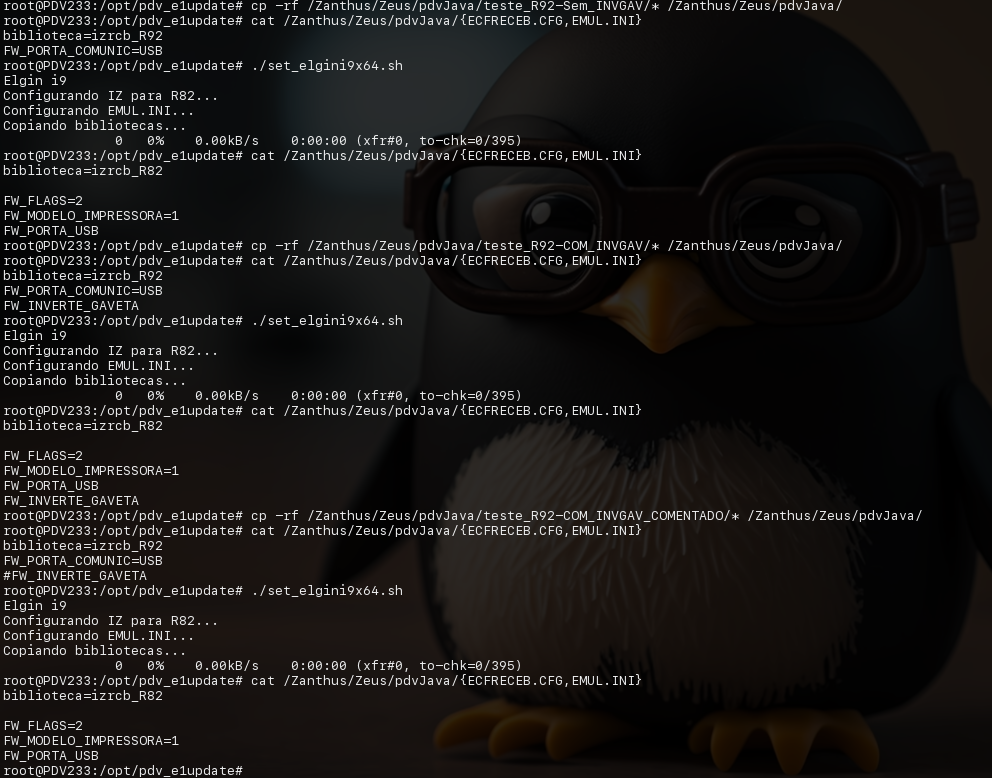

# pdv_elgini9x64
- Uso:
1) Baixar repositório e entrar no diretório
```bash
git clone https://github.com/elppans/pdv_elgini9x64.git
cd pdv_elgini9x64
```
2) Executar Script

```bash
./set_elgini9x64.sh
```
## Imagem dos testes em PDV local  


